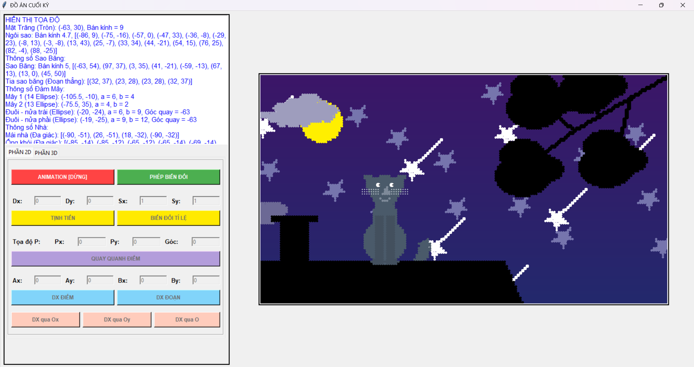
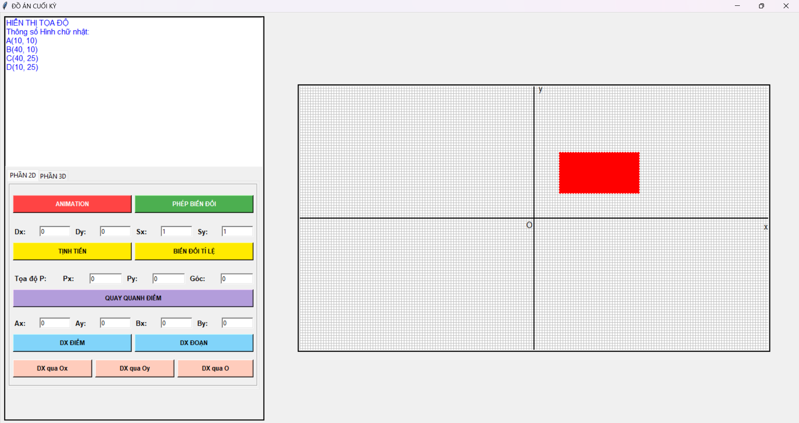
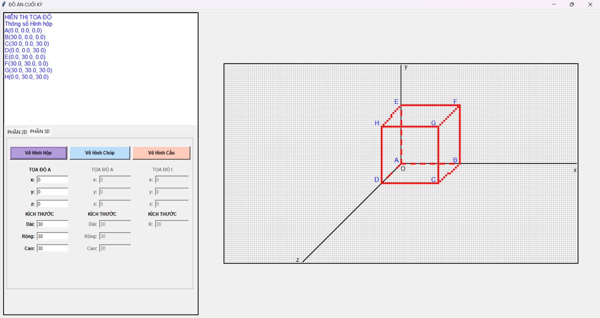

# ĐỒ ÁN KỸ THUẬT ĐỒ HỌA (2024–2025)

Một dự án minh hoạ kỹ thuật đồ họa bằng Python sử dụng thư viện Turtle. Ứng dụng thực hiện vẽ các hình cơ bản và tổ hợp (mặt trăng, ngôi sao, đám mây, ngôi nhà, cây, mèo), mô phỏng một số phép biến đổi hình học và trình bày một số hình 3D giả lập bằng phép chiếu xiên.

---

## Demo
Minh hoạ giao diện và kết quả:





---

## Tóm tắt nội dung
Dự án tập trung vào:

- Vẽ các hình cơ bản: đường thẳng, hình tròn, ellipse, tam giác, đa giác.
- Tổ hợp và biến đổi hình học: quay, dịch, tỷ lệ, ghép các hình để tạo đối tượng phức tạp (ví dụ: mèo, nhà).
- Mô phỏng 3D cơ bản: phép chiếu xiên (Cabinet projection) để hiển thị hộp, chóp, và cạnh khuất/cạnh nổi.
- Cách thể hiện các đối tượng bằng nét vẽ khác nhau (nét liền, nét đứt) để phân biệt cấu trúc.

---

## Người thực hiện
- Lớp: D22CQPTUD01-N  
- Giảng viên hướng dẫn: Dương Thanh Thảo

Thành viên:
- Nguyễn Chí Thịnh — [hnihTyoB](https://github.com/hnihTyoB)  
- Huỳnh Thanh Trà — [HuynhThanhTra](https://github.com/HuynhThanhTra)  
- Trần Quang Hùng — [Anroiy123](https://github.com/Anroiy123)  
- Tô Duy Hào — [Shunnio](https://github.com/Shunnio)

---

## Các thành phần chính (chi tiết)
- Mặt trăng: vẽ bằng cung tròn/hình tròn, kết hợp để tạo hiệu ứng khuyết.  
- Ngôi sao: tạo từ đa giác 5 cánh, kết hợp phép quay để hoàn thiện.  
- Đám mây: ghép nhiều ellipse để tạo hình mềm mại, tự nhiên.  
- Ngôi nhà: đa giác cho thân và mái, thêm ống khói và cửa sổ.  
- Cây: thân là đoạn thẳng, tán là các ellipse/đa giác.  
- Mèo: tổ hợp hình tròn, tam giác cho tai, đường cong cho đuôi và chi tiết mặt.  
- Hình 3D (hộp/chóp/cầu giả lập): sử dụng phép chiếu xiên để mô phỏng chiều sâu, phân biệt cạnh khuất bằng nét đứt.

---

## Kỹ thuật & ý tưởng triển khai
- Hình học cơ bản: hình tròn, ellipse, đa giác, tam giác đều.  
- Phép quay và biến đổi affine: xoay quanh tâm, dịch, tỉ lệ.  
- Phép chiếu xiên (Cabinet projection) để mô phỏng các đối tượng 3D đơn giản.  
- Kỹ thuật vẽ: sử dụng nét liền/đứt để phân biệt các cạnh, ghép nhiều phần tử nhỏ để tạo hình phức tạp.

---

## Công nghệ sử dụng
- Ngôn ngữ: Python (phiên bản khuyến nghị: Python 3.8 trở lên)  
- Thư viện chính:
  - turtle (thư viện đồ họa 2D tích hợp trong CPython)
  - tkinter (dùng cho giao diện, thường kèm theo phân phối chính thức của Python)

---

## Hướng dẫn cài đặt & chạy
1. Chuẩn bị môi trường
   - Cài đặt Python 3.8+ (tải từ https://www.python.org/).
   - Tạo và kích hoạt virtual environment (khuyến nghị):
     ```bash
     python -m venv venv
     source venv/bin/activate    # macOS / Linux
     venv\Scripts\activate       # Windows (PowerShell hoặc cmd)
     ```
2. Cài đặt phụ thuộc
   - Thư viện `turtle` và `tkinter` thường có sẵn trong CPython. Nếu hệ thống của bạn thiếu `tkinter`, cài đặt theo hệ điều hành:
     - Debian/Ubuntu:
       ```bash
       sudo apt-get update
       sudo apt-get install python3-tk
       ```
     - Fedora:
       ```bash
       sudo dnf install python3-tkinter
       ```
     - Windows/macOS: cài Python chính thức từ https://www.python.org/ (gói cài đặt thường bao gồm tkinter). Nếu dùng bản Python từ Homebrew hoặc distro khác, kiểm tra hướng dẫn tương ứng để bổ sung tk.
   - Nếu repo có file requirements.txt, cài đặt:
     ```bash
     pip install -r requirements.txt
     ```
   - LƯU Ý: Không cần pip install `turtle`/`tkinter` trên hầu hết hệ thống; những module này là một phần của chuẩn thư viện Python (CPython).
3. Chạy chương trình
   - Chạy file chính của dự án (ví dụ):
     ```bash
     python <ten_tap_chinh>.py
     ```
   - Thay `<ten_tap_chinh>.py` bằng tên tệp khởi tạo ứng dụng trong repo (ví dụ: `main.py`, `app.py`).

---

## Tài liệu tham khảo
- Turtle Graphics — Python Standard Library: https://docs.python.org/3/library/turtle.html  
- Tkinter — Python Standard Library: https://docs.python.org/3/library/tkinter.html  
- Tài liệu giảng dạy: Dương Thanh Thảo — Bài giảng & Giáo trình học phần Kỹ thuật đồ họa, Học viện Công nghệ Bưu chính – Viễn thông (2025)

---

Nếu bạn thấy dự án hữu ích, vui lòng đánh dấu ⭐️ repository để ủng hộ.
